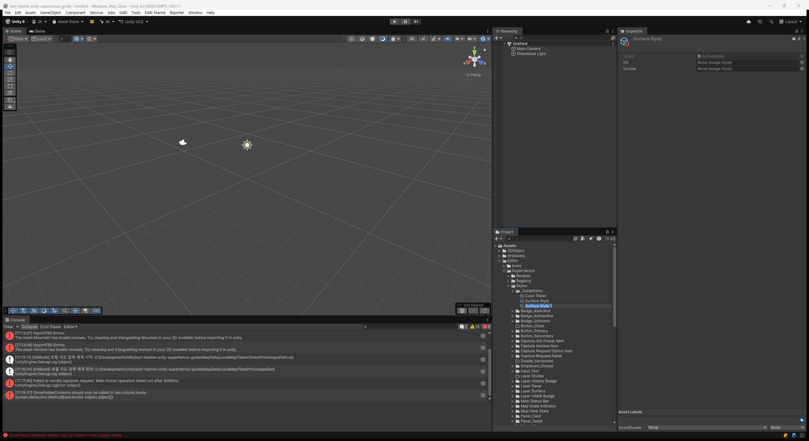
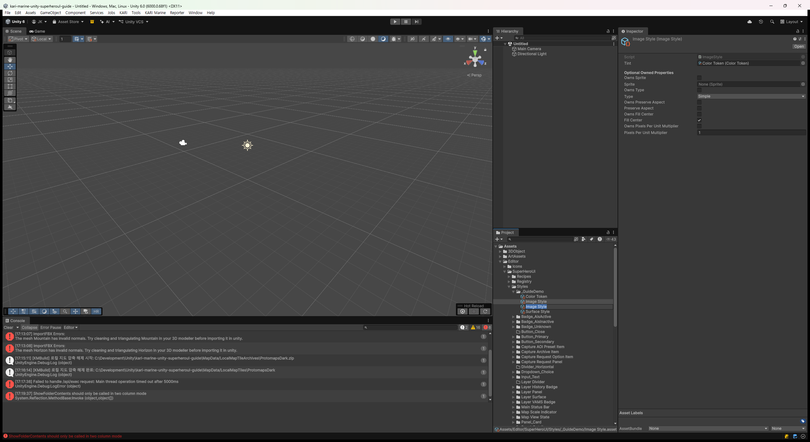
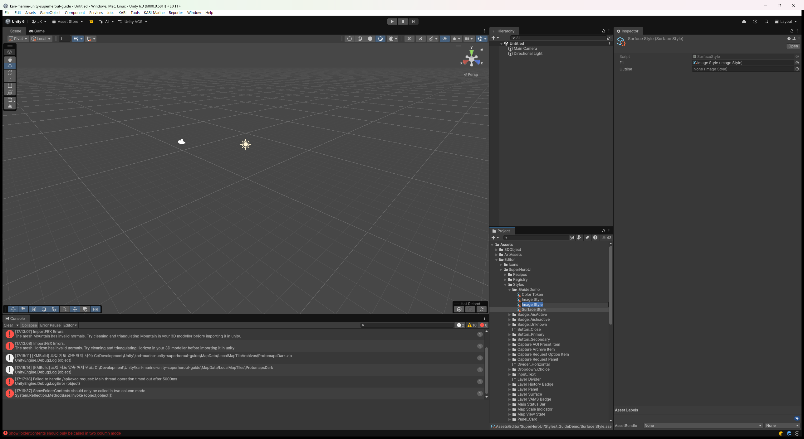
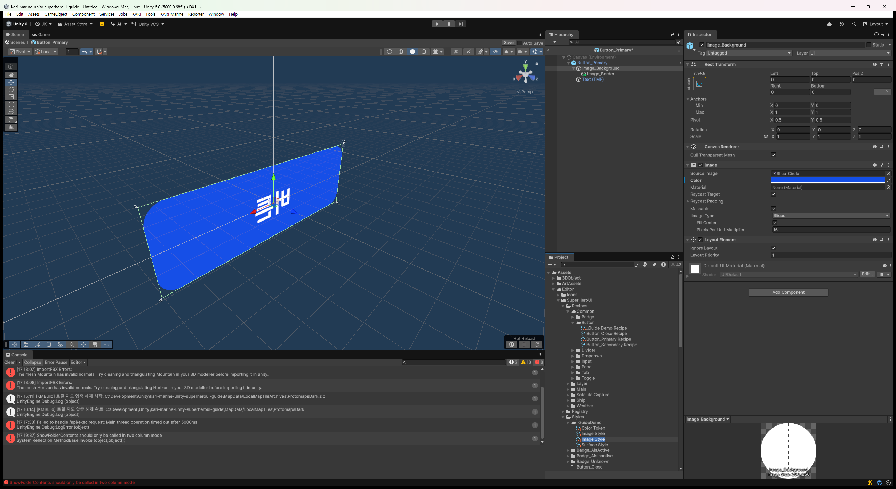
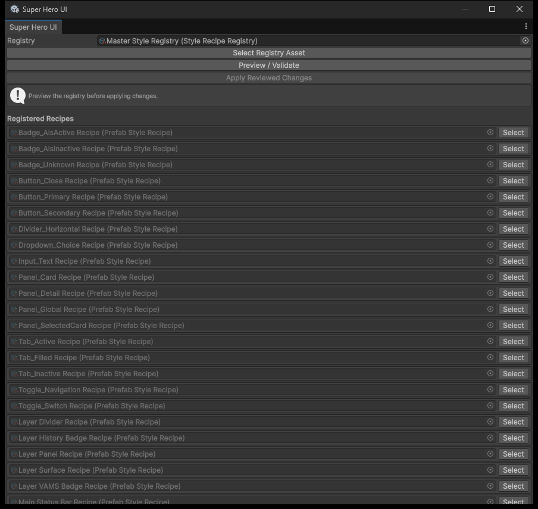
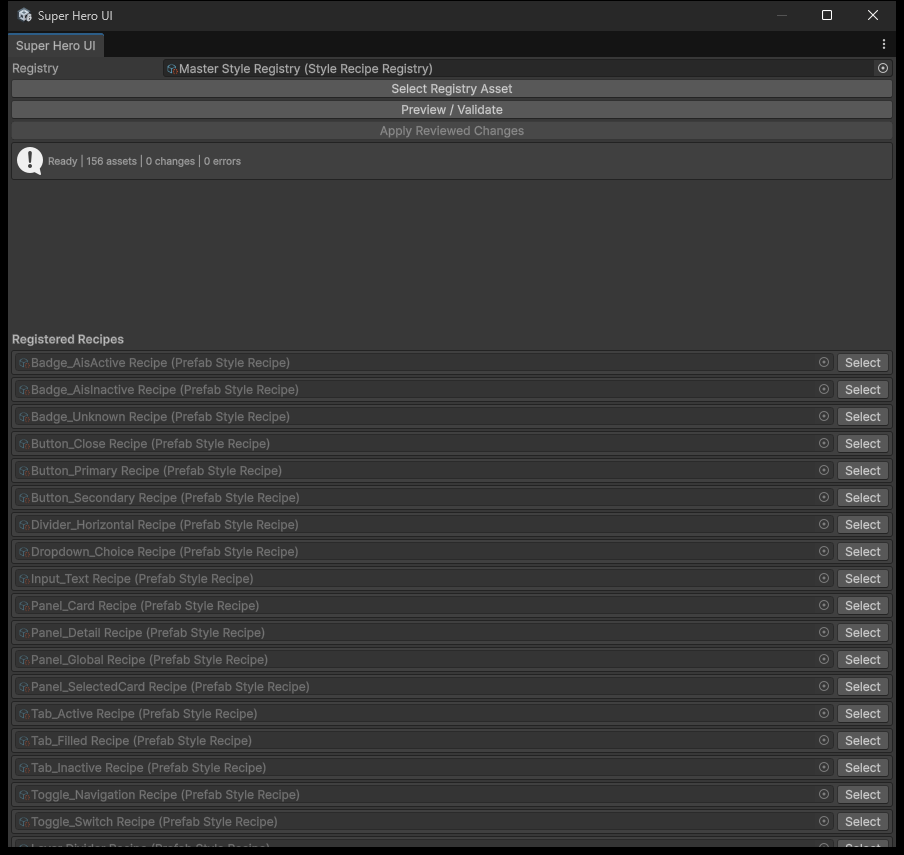
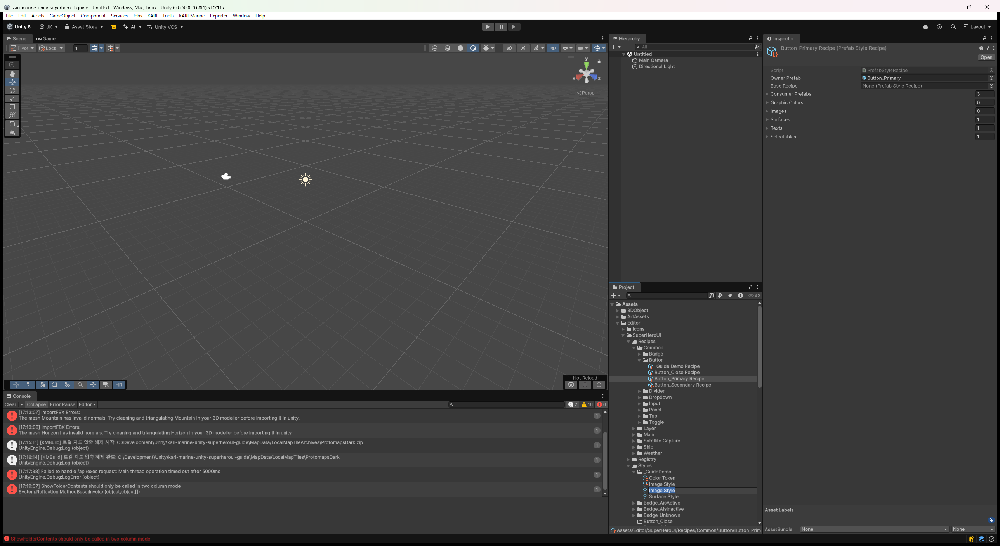

# Super Hero UI 패키지 사용 가이드 (스크린샷 포함)

이 문서는 `com.superherounite.ui` (Super Hero UI) 패키지를 실제로 어떻게 쓰는지 화면 캡처와 함께 단계별로 보여주는 실습형 가이드다. 패키지 자체의 상세 계약은 [index.ko.md](index.ko.md)에 있으며, 이 문서는 그 계약을 소비 프로젝트([`kari-marine-unity`](https://github.com/superherounite/kari-marine-unity))의 실제 화면과 실제 자산(`Assets/Editor/SuperHeroUI/...`)을 예시로 삼아 눈으로 따라갈 수 있게 재구성한 것이다. 다른 소비 프로젝트에서는 폴더 위치나 세부 값이 다를 수 있으니, 구조 자체(Style → Recipe → Registry → Preview → Apply)를 기준으로 읽는다.

> 스크린샷은 이 가이드 작성을 위해 별도로 띄운 격리된 Unity Editor 인스턴스(전용 git worktree)에서 캡처했다. 실제 작업 중인 Editor 화면이 아니므로 일부 배경 색상이 팀 로컬 환경과 다를 수 있다.

## 목차

1. [이 패키지가 하는 일 / 안 하는 일](#1-이-패키지가-하는-일--안-하는-일)
2. [핵심 용어 5가지](#2-핵심-용어-5가지)
3. [이 프로젝트의 실제 폴더 구조](#3-이-프로젝트의-실제-폴더-구조)
4. [단계별 실습: 새 Style 만들고 Prefab에 적용하기](#4-단계별-실습-새-style-만들고-prefab에-적용하기)
5. [실제 예시로 읽어보기: Button_Primary](#5-실제-예시로-읽어보기-button_primary)
6. [Preview / Apply 상태값 읽는 법](#6-preview--apply-상태값-읽는-법)
7. [자주 하는 실수](#7-자주-하는-실수)

---

## 1. 이 패키지가 하는 일 / 안 하는 일

Super Hero UI는 **Editor 전용 제작 도구**다. 게임이 실행되는 런타임에는 이 패키지의 코드가 전혀 포함되지 않는다(runtime assembly 없음). 하는 일은 딱 하나: **ScriptableObject 자산(Style)에 적어둔 값을, 지정한 Prefab의 기존 컴포넌트(Image, TextMeshProUGUI, Selectable 등)에 "구워 넣는다(bake)".**

- **한다**: 색상·이미지 표현·타이포그래피·Selectable 색상 전이 값을 Style 자산에서 관리하고, Preview로 미리 확인한 뒤 Apply로 실제 Prefab 컴포넌트 값을 덮어쓴다.
- **안 한다**: 컴포넌트를 새로 추가하거나, 계층 구조를 만들거나, 런타임에 스타일을 조회/적용하지 않는다. 콘텐츠 텍스트, 위치/크기(anchor·RectTransform), 레이아웃, 클릭 동작(UnityEvent), 입력 검증 같은 건 여전히 프로젝트가 직접 소유한다.

즉 **"디자인 값(색·글꼴·외곽선 두께 등)의 단일 원본을 Style 자산으로 두고, 여러 Prefab에 일관되게 반영하는 Editor 빌드 도구"**라고 이해하면 된다.

## 2. 핵심 용어 5가지

| 용어 | 정체 | 이 프로젝트에서의 위치 |
|---|---|---|
| **Style 자산** | `Color Token` / `Image Style` / `Surface Style` / `Text Style` / `Selectable Style` 5종의 ScriptableObject | `Assets/Editor/SuperHeroUI/Styles/` |
| **Recipe** (`Prefab Style Recipe`) | "어떤 Prefab의 어떤 컴포넌트에 어떤 Style을 적용할지"를 선언하는 자산 | `Assets/Editor/SuperHeroUI/Recipes/` |
| **Owner Prefab** | Recipe가 값을 구워 넣을 대상 Prefab (Recipe 1개당 Owner 1개) | `Assets/Prefabs/UI/...` |
| **Consumer Prefab** | Owner를 중첩(nested instance)으로 포함하면서 override 여부를 검사받는 외부 Prefab | Recipe의 `Consumer Prefabs` 목록 |
| **Registry** (`Style Recipe Registry`) | 검증 대상 Recipe들을 모아놓은 자산. Preview/Apply는 이 Registry 단위로 실행 | `Assets/Editor/SuperHeroUI/Registry/Master Style Registry.asset` |

흐름은 `Style 자산 → Recipe(Owner에 어디를 캡처할지 기록) → Registry(Recipe 묶음) → Preview → Apply` 순서다.

### Style 5종이 소유하는 값

| Style | 적용 대상 컴포넌트 | 소유하는 필드 |
|---|---|---|
| `Color Token` | (다른 Style이 참조) | 색상 하나(`Value`) |
| `Image Style` | `UnityEngine.UI.Image` | Tint(ColorToken 참조) + 선택적으로 Sprite / Image.Type / Preserve Aspect / Fill Center / Pixels Per Unit Multiplier |
| `Surface Style` | Image 2개(Fill + 선택적 Outline) | `Fill`(Image Style), `Outline`(Image Style) |
| `Text Style` | `TMPro.TextMeshProUGUI` | Font, Color, Font Size, Font Style, Auto Size 범위, Character/Word/Line/Paragraph Spacing |
| `Selectable Style` | `UnityEngine.UI.Selectable`(Button 등) | Normal/Highlighted/Pressed/Selected/Disabled Color, Color Multiplier, Fade Duration |

## 3. 이 프로젝트의 실제 폴더 구조

`Assets/Editor/SuperHeroUI/`는 셋으로 나뉜다. (아래 5절 스크린샷의 Project 창에서 `Recipes/Common/Button/` 하위 구조를 실제로 확인할 수 있다.)

```text
Assets/Editor/SuperHeroUI/
  Styles/    (Style 자산 - Recipe 이름과 같은 하위 폴더에 Fill/Outline/Surface/Text 자산이 모여 있다)
  Recipes/   (Prefab Style Recipe 자산 - 화면/공통 컨트롤별 하위 폴더)
  Registry/  (Master Style Registry.asset 하나)
```

대상 Prefab(Owner)은 여기 있지 않고 평소처럼 `Assets/Prefabs/UI/Common/...`, `Assets/Prefabs/UI/Features/...` 같은 일반 런타임 계층에 있다. **Style 자산 폴더는 제작용, Prefab 폴더는 런타임용**이라는 구분만 기억하면 된다.

## 4. 단계별 실습: 새 Style 만들고 Prefab에 적용하기

여기서는 실제로 없는 예시 대신, 앞으로 팀이 반복할 절차를 그대로 순서대로 보여준다.

### 4-1. Style 자산 만들기

Project 창에서 `Assets/Editor/SuperHeroUI/Styles/` 아래 원하는 폴더로 이동한 뒤 우클릭 → **Create > Super Hero UI > Styles > (원하는 종류)**를 선택한다. (같은 메뉴가 상단 **Assets > Create > Super Hero UI > Styles**에도 그대로 있다.)

- 단색 하나가 필요하면 **Color Token**부터 만든다. 이후 Image/Text/Selectable Style이 색을 고를 때 Enum이 아니라 이 자산을 직접 드래그해서 참조하므로, 색을 추가하거나 이름을 바꿔도 코드를 다시 컴파일할 필요가 없다.

  

- 배경/테두리처럼 Image 두 장을 세트로 다루면 **Surface Style**, 낱장 Image 하나만 다루면 **Image Style**을 만든다. Image Style의 `Tint` 슬롯에 방금 만든 Color Token을 드래그한다.

  

- Surface Style의 `Fill`(필수) / `Outline`(선택) 슬롯에 각각 Image Style을 드래그해서 채운다.

  

- 글자는 **Text Style**, 버튼처럼 상태별 색이 바뀌는 Selectable(Button 등)은 **Selectable Style**을 만든다. (필드 구성은 위 [2절 표](#2-핵심-용어-5가지) 참고.)

### 4-2. Prefab Style Recipe 만들고 Owner 지정하기

`Assets/Editor/SuperHeroUI/Recipes/` 아래 적절한 폴더에서 우클릭 → **Create > Super Hero UI > Recipes > Prefab Style Recipe**. 생성된 Recipe를 선택하면 Inspector가 이렇게 빈 상태로 보인다.


1. **Owner Prefab** 슬롯에 스타일을 적용할 Prefab을 드래그한다. (이 Recipe 하나가 관리할 수 있는 Owner는 항상 1개다.)
2. 필요한 Binding 배열(`Graphic Colors` / `Images` / `Surfaces` / `Texts` / `Selectables`) 중 원하는 항목의 크기를 늘리고, `Style` 슬롯에 4-1에서 만든 Style 자산을 연결한다.

값을 다 채우면 아래 5절의 `Button_Primary Recipe`처럼 각 줄에 대상 Style과 "Not captured" 상태의 target 행이 보인다.

### 4-3. Prefab Mode에서 대상 컴포넌트를 Capture 하기

Recipe에 Style만 연결한 상태로는 아직 "어느 GameObject의 어느 컴포넌트"인지 모른다. 이걸 알려주는 게 각 target 행의 **Capture** 버튼이다.

1. Owner Prefab을 더블클릭해 **Prefab Mode**로 연다.
2. 스타일을 적용할 GameObject(예: 배경 Image가 붙은 오브젝트)를 Hierarchy에서 선택한다.
3. Recipe Inspector로 돌아와 해당 Binding 줄의 **Capture** 버튼을 누른다.

아래는 실제로 `Button_Primary` Prefab을 Prefab Mode로 연 화면이다. Hierarchy에 `Image_Background`(Fill 대상) → `Image_Border`(Outline 대상), `Text (TMP)`가 보인다 — 정확히 5절에서 설명하는 Surface/Text 캡처 대상이다.



(Project 창의 `Styles/_GuideDemo/`는 이 가이드의 4-1 실습용으로 임시로 만들었다가 지운 폴더다. 실제 프로젝트에는 없다.)

Capture를 누르면 target 행에 `Not captured` 대신 `오브젝트이름/자식이름` 같은 경로가 표시되고, 내부적으로는 Unity의 `GlobalObjectId`(직렬화 identity)를 저장한다. 그래서 이후 이름을 바꾸거나 계층을 옮겨도(같은 오브젝트인 한) 추적이 끊기지 않는다. 컴포넌트를 지우고 새로 만들었을 때만 다시 Capture하면 된다.

- **Select** 버튼: 캡처해둔 대상을 다시 Prefab Mode로 열어 선택해준다(확인용).
- **Clear** 버튼: 캡처 정보를 지운다.

> Surface Binding은 Fill 대상과 Outline 대상을 각각 따로 Capture해야 한다. Fill용 Image와 Outline용 Image, 2개의 GameObject를 순서대로 선택하면서 두 번 누른다.

Prefab Mode에서 저장하지 않은 변경(탭에 `*` 표시)이 남아 있으면 Preview/Apply 검증이 막힌다. Capture 전에 항상 Ctrl+S로 저장해둔다. (Prefab Mode를 닫을 때 "Prefab Has Been Modified" 대화상자가 뜨면, 의도한 변경인지 먼저 확인하고 Save/Discard를 고른다.)

### 4-4. Registry에 등록하고 Preview → Apply

새 Recipe를 기존 `Master Style Registry.asset`의 `Recipes` 배열에 추가한다(Registry Inspector에서 배열 크기를 늘리고 드래그).

**Tools > Super Hero UI > Style Recipes** 메뉴로 전용 창을 연다. 위쪽 `Registry` 필드에 대상 Registry 자산이 잡혀 있는지 확인한다(보통 첫 번째로 찾은 Registry가 자동으로 잡힌다. 여러 개면 직접 드래그). 아래는 이 프로젝트의 `Master Style Registry`를 연 직후, 아직 Preview를 누르기 전 상태다 — 등록된 Recipe 목록만 보이고 위쪽 안내 문구는 "Preview the registry before applying changes."다.



1. **Preview / Validate** 버튼을 누른다. 실제 자산을 저장하지 않고, "어떤 Owner의 어떤 속성이 어떤 값으로 바뀔 예정인지" 목록만 보여준다.
2. 목록을 읽고 의도한 변경이 맞는지 확인한다. 에러가 있으면(빨간 박스) 먼저 그것부터 해결한다.
3. 문제가 없으면 **Apply Reviewed Changes**를 누른다. 이 시점에 실제로 Owner Prefab이 갱신되고 저장된다.

아래는 같은 창에서 Preview를 실행한 직후다. 이 프로젝트는 이미 모든 Recipe가 적용되어 있어서 `Ready | 156 assets | 0 changes | 0 errors`로 뜬다 — "지금 이 순간 Prefab들이 전부 Recipe와 일치한다"는 뜻이다.



새 Recipe를 추가한 직후라면 이 배너에 `Stale | N assets | N changes | 0 errors`처럼 뜨고, 그 아래 스크롤 영역에 변경될 속성 목록이 나온다. 그 목록을 검토한 뒤 **Apply Reviewed Changes**를 눌러야 실제로 반영된다. Apply 후 다시 **Preview / Validate**를 눌러서 변경/에러가 0개(`Ready`)로 나오는지 확인하는 습관을 들인다. `Ready` 상태에서 같은 값을 다시 Apply해도 아무 것도 바뀌지 않는다(멱등).

## 5. 실제 예시로 읽어보기: Button_Primary

이론만으로는 감이 안 잡히니, 이 프로젝트에 이미 있는 `Button_Primary Recipe.asset`을 그대로 읽어본다.

- **Owner Prefab**: `Assets/Prefabs/UI/Common/Redesign/Button/Button_Primary.prefab`
- **Surface Binding** 1개
  - Fill 대상: `Button_Primary/Image_Background` (`UnityEngine.UI.Image`)
  - Outline 대상: `Button_Primary/Image_Background/Image_Border` (`UnityEngine.UI.Image`)
  - Style: Surface Style 자산 1개 (Fill + Outline 색상 정의)
- **Text Binding** 1개
  - 대상: `Button_Primary/Text (TMP)` (`TMPro.TextMeshProUGUI`)
- **Selectable Binding** 1개
  - 대상: `Button_Primary` 루트 자신 (`UnityEngine.UI.Button`)
- **Consumer Prefabs**: 3개 — `Button_Primary`를 중첩 Prefab으로 포함하는 다른 화면 Prefab들. 이 목록에 있는 Prefab에서 Recipe가 관리하는 속성(배경색, 글자 스타일 등)을 개별적으로 override하면 검증에서 에러로 잡힌다. "버튼 색은 항상 Style 하나로 통일한다"는 규칙을 자동으로 강제하는 셈이다.



(Project 창에 보이는 `_Guide Demo Recipe`도 같은 이유로 임시로 만들었다가 지운 자산이다.)

이 Recipe를 보면, 버튼 하나를 스타일링하는 데 왜 Surface + Text + Selectable 3개 Binding이 필요한지 알 수 있다. **배경/테두리 색은 Surface, 라벨 글자는 Text, 클릭 시 색 전이(Highlighted/Pressed 등)는 Selectable**로 역할이 분리되어 있기 때문이다.

## 6. Preview / Apply 상태값 읽는 법

Style Recipe Window 상단 배너에 `{상태} | N assets | N changes | N errors` 형식으로 요약이 뜬다.

| 상태 | 의미 | 대응 |
|---|---|---|
| **Ready** | 마지막 Apply 이후 아무것도 안 바뀜 | 그대로 두면 됨 |
| **Stale** | Prefab 값이 Recipe와 다르거나, Preview 이후 입력(Style/Recipe/Owner 등)이 바뀌어 이전 승인이 무효화됨 | 다시 **Preview / Validate** → 목록 확인 → **Apply** |
| **Error** | Recipe를 안전하게 평가/적용할 수 없음 (예: Missing Script, 같은 속성을 Binding 2개가 동시에 소유, Consumer가 관리 속성을 override) | 에러 메시지에 나온 Owner/Recipe부터 원인 수정 |

**Apply Reviewed Changes** 버튼은 직전 **Preview**와 정확히 같은 "지문(fingerprint)"일 때만 활성화된다. Preview를 실행한 뒤 다른 사람이 같은 Style/Recipe/Prefab을 건드리면 그 Preview는 자동으로 무효가 되고, 반드시 다시 Preview해야 Apply 버튼이 살아난다. "미리보기 없이 바로 적용"이 구조적으로 불가능하게 만든 안전장치다.

## 7. 자주 하는 실수

- **Prefab Mode에서 저장 안 하고 Capture/Preview**: 저장하지 않은 변경이 있으면 검증이 통째로 막힌다. Capture 전에는 항상 저장.
- **Consumer Prefab에 직접 override**: Owner를 중첩한 화면에서 배경색만 바꾸고 싶어서 Inspector에서 직접 override하면 에러가 난다. 정말 다른 배색이 필요하면, 해당 Prefab을 **Prefab Variant**로 만들고 그 Variant 전용 Recipe를 새로 만들어 `Base Recipe`로 원본을 지정한다(패키지가 지원하는 "의도적 specialization" 경로).
- **한 속성을 Binding 2개가 동시에 관리**: 예를 들어 같은 Image를 Image Binding과 Surface Binding의 Fill 대상으로 동시에 캡처하면, 제안 값이 같아도 에러로 처리된다. 속성 하나는 Binding 하나만 소유해야 한다.
- **Registry를 나눠서 같은 Prefab을 이중 관리**: 서로 다른 Registry는 교차 검사하지 않으므로, 같은 Owner를 두 Registry에 걸쳐 등록하면 검증이 서로를 모르는 채로 충돌할 수 있다. Owner 하나는 Registry 하나, Recipe 하나로 유지한다.
- **Apply를 안 누르고 Preview 결과만 보고 "적용됐다"고 착각**: Preview는 읽기 전용이다. 실제로 Prefab을 갱신하려면 반드시 Apply Reviewed Changes까지 눌러야 한다.

---

전체 계약, Variant specialization 규칙, Play/Build guard 세부 동작 등은 [index.ko.md](index.ko.md)를 참고한다.
